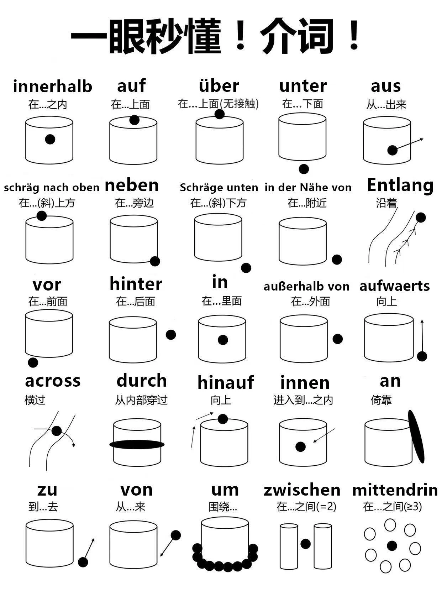

> 资料来源：
>
> http://deyudeguo.com/%E5%BE%B7%E8%AF%AD%E6%9C%80%E5%B8%B8%E7%94%A8%E7%9A%8425%E4%B8%AA%E4%BB%8B%E8%AF%8D

## Zeit（时间）

| 介词 | Bedeutung (意义) | Beispiel (例句) |
| --- | --- | --- |
| um | Uhrzeit (时间点) | Sie treffen sich um acht. (他们八点见面。) |
| bis | Endpunkt (终点) | Er hat bis sieben Uhr gearbeitet. (他工作到七点。) |
| von (+ Dat.) ... bis + Akk. | Beginn (von) ... Endpunkt (bis) (开始 ... 结束) | Gestern hat er von acht bis halb neun gewartet. (昨天他从八点等到八点半。) |
| für | Zeitspanne (时间段) | Nächste Woche fahren sie für zwei Wochen in Urlaub. (下周他们要去度假两周。) |
| über | länger/mehr als (更长/更多) | Er hat letzte Woche schon über zwei Stunden auf sie gewartet. (上周他已经等了她两个多小时。) |
| an/am | Tage Tageszeiten (日子 一天中的时间) | Ach, wir treffen uns am Dienstag? Am Abend hat er immer Zeit für sie. ⚠️ in der Nacht (在晚上) |
|  | Datum (日期) | Am 15. Mai wollen sie heiraten. (他们打算在五月十五日结婚。) |
| in/im | irgendwann in diesem Zeitraum Zeitpunkt in der Zukunft (在这个时间段内的某个时候 未来的某个时间点) |Im Sommer geht er gern spazieren. In einer Stunde treffen sie sich. (夏天他喜欢散步。 一小时后他们见面。)|
| vor nach + Dat. | vor (在 ... 之前) nach (在 ... 之后) | Schon vor der Arbeit ruft er sie an. Nach der Arbeit sieht er sie endlich. (上班前他就给她打电话。 下班后他终于见到她。) |
| seit | Vergangenheit bis jetzt (过去到现在) | Seit einer Woche kann er nicht mehr schlafen. (他已经一个星期没睡好觉了。) |
| ab | jetzt (现在起) | Ab morgen will er keinen Kaffee mehr trinken. (从明天起他不想再喝咖啡了。) |
| von ... an | Beginn (开始) | Vom 1. Januar an will er nicht mehr rauchen. (从一月一号起他不想再抽烟了。) |
| bei | gleichzeitig (同时) | Schon beim Frühstück denkt er an sie. (吃早饭时他就想起她。) |
| während | gleichzeitig (同时) | Schon während des Frühstücks denkt er an sie. (在吃早饭时他就想起她。) |
| innerhalb + Gen. | irgendwann in einem bestimmten Zeitraum (在某个确定的时间段内) | Er ist innerhalb der nächsten Stunde zu Hause. (他将在接下来的一个小时内回家。) |
| außerhalb + Gen. | nicht in einem bestimmten Zeitraum (不在某个确定的时间段内) | Er wollte sie in der Firma anrufen. Aber er rief außerhalb der Geschäftszeiten an und konnte sie nicht erreichen. (他想在公司给她打电话。但他是在营业时间之外打的，没能联系上她。) |

## Ort（方位）

bis、nach后不接冠词

只有an in auf über vor hinter neben unter zwischen有静三动四
